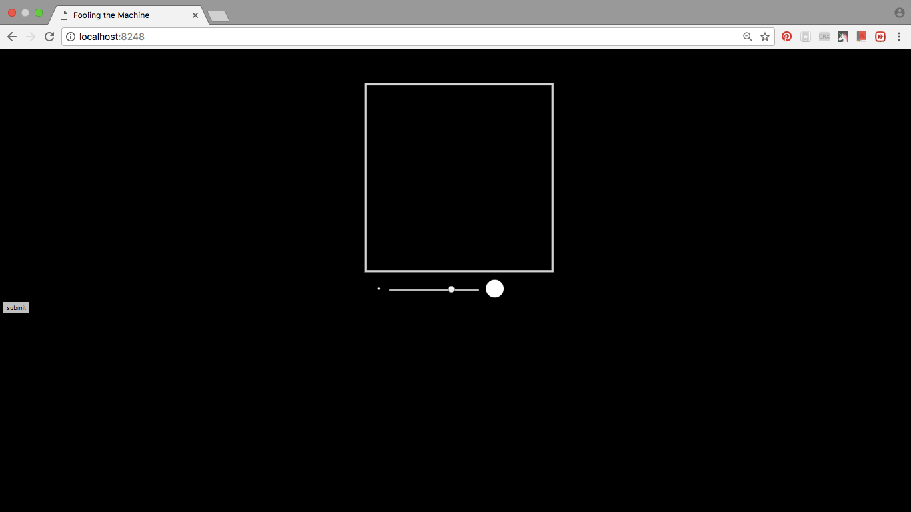

# Fooling the Machine
### Final project for Nature of Code-Intelligence-Learning, taught by Daniel Shiffman at ITP, NYU
Fooling the Machine is an interactive installation that generates 10 images of digits 0, 1...9 with users' drawing inputs.

## Quick Look

## Process
It started with a simple machine learning model that recognizes and categorize handwriting digits using MNIST dataset. With 15 iterations of training on 60,000 handwriting digits, the system achieves 99.56% accuracy on training dataset and 99.17% accurancy on testing dataset.
A Python server is running behind the scene with a p5 front-end web page. Users are able to draw anything on the canvas with various line weight. On submitting the drawing, the machine will take this drawing, categorize it into one out of the ten digits and display the result on the screen.
A small version of the drawing will be put at a certain position, which forms a number along with other drawings.

## Future
- a collaborative web experience
- user can save the drawing(email, local etc.)

## Reference
[Fooling the Machine](http://www.popsci.com/byzantine-science-deceiving-artificial-intelligence)

[Shiffman's cnn flask example](https://github.com/shiffman/NOC-S17-2-Intelligence-Learning/tree/master/week5-cnn-tensorflow/02b_cnn_flask_p5)
