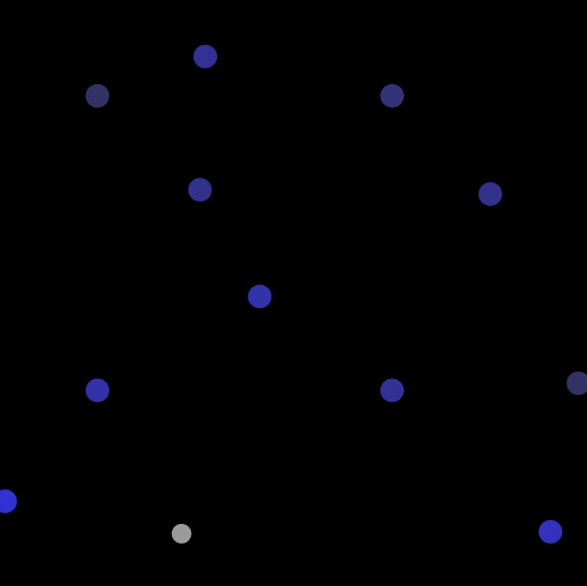
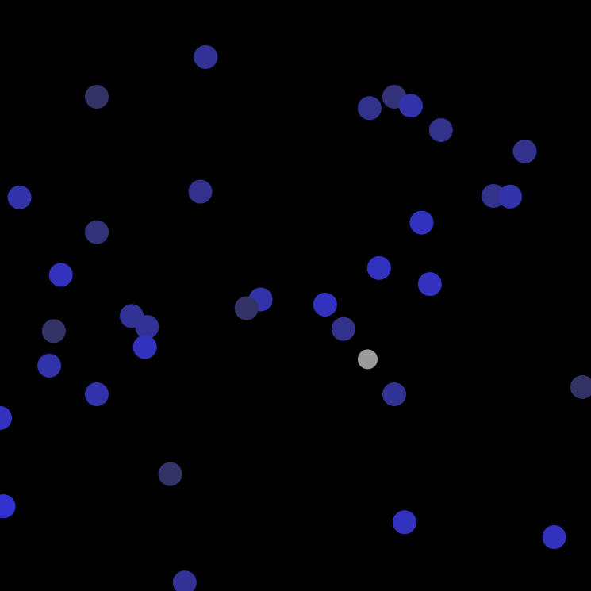

# KNN Music
A very simple music generator using knn algorithm (One Nearest Neighbor)

### How it works

The white ellipse is the main character here, moving around according to Perlin noise.
Notes are added to the screen with random pitch and random position.
Every frame, the closest note to the main character is played.

### Demo
live demo is avaiable [here](www.adazhao.com/knn_music)

### Credit
The sample code is credit to Dan Shiffman
